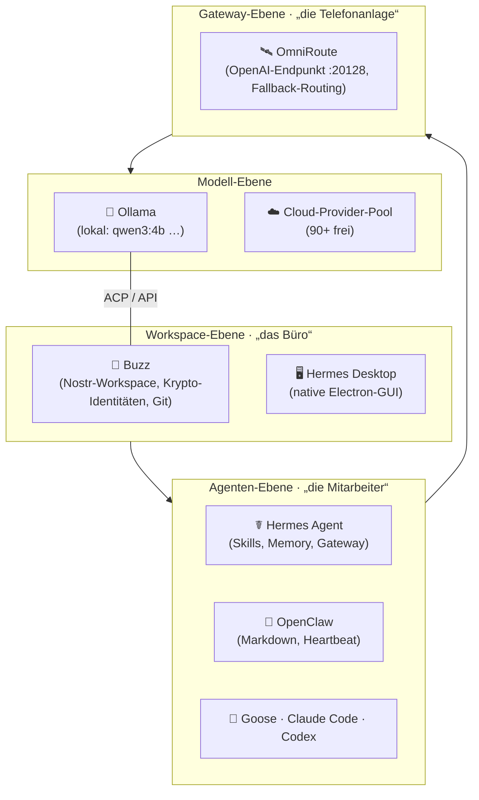
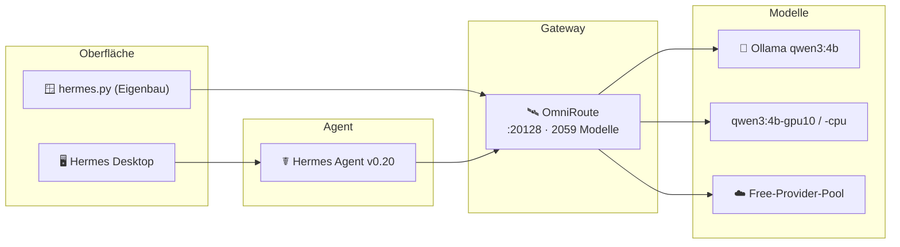

# Agent-Stack-Vergleich: Buzz · OmniRoute · Hermes · Hermes Desktop · OpenClaw (+ „Hermes OS"-Eigenbauten)

> Stand: **13. August 2026** · Recherchiert aus offiziellen Quellen (Block Engineering Blog, Nous Research, GitHub-Repos) sowie YouTube-/Community-Berichten.
> Ein Wort vorweg: **Buzz, Hermes und OmniRoute sind keine Konkurrenten im engeren Sinn — sie sitzen auf verschiedenen Ebenen des Stacks** (Büro → Mitarbeiter → Gateway → Modelle). Wer sie gegeneinander stellt, vergleicht Äpfel mit Birnen.

---

## 1. Das Bild in 30 Sekunden

| | Rolle | Ein-Satz-Beschreibung |
|---|---|---|
| 🐝 **Buzz** (Block) | **Workspace / „Büro"** | Nostr-basierter, selbst-hostbarer Arbeitsraum, in dem Menschen **und** Agenten mit eigener Identität in denselben Channels sitzen. |
| ☤ **Hermes Agent** (Nous) | **Agent / „Mitarbeiter"** | Server-seitiger Agent mit Lern-Schleife (Skills), persistentem Memory und 15+ Plattform-Gateway. |
| 🖥️ **Hermes Desktop** | **GUI auf Hermes** | Die native Electron-Oberfläche, die den Hermes-Agenten bedienbar macht. |
| 🦞 **OpenClaw** | **Agent / „Mitarbeiter"** | Leichtgewichtiger Terminal-Agent (Markdown-basiert), erreicht dich über WhatsApp/Telegram/Signal. |
| 🛰️ **OmniRoute** | **Gateway / „Router"** | OpenAI-kompatibler Endpunkt, der alle Provider + Modelle poolt, routet und bei Fehlern automatisch wechselt. |
| 🧩 **„Hermes OS"-Eigenbauten** | **Kombi-Builds** | YouTube-/Community-Bauten aus Hermes + Claude + Tools; deine eigenen Builds gehören dazu. |

Die Kern-Metapher aus der Community:

> **Hermes & OpenClaw sind die „Angestellten", Buzz ist das „Büro", OmniRoute ist die „Telefonanlage".**

---

## 2. Ebenen-Modell

---

## 3. Feature-Matrix (Gesamtvergleich)

Legende: ✅ = nativ · 🟡 = teilweise / über Plugin · ❌ = nicht vorhanden

| Feature | 🐝 Buzz | ☤ Hermes Agent | 🖥️ Hermes Desktop | 🦞 OpenClaw | 🛰️ OmniRoute |
|---|:---:|:---:|:---:|:---:|:---:|
| **Typ / Ebene** | Workspace | Agent-Harness | GUI | Agent | Gateway |
| **Lizenz** | Open Source | MIT | MIT | Open Source | MIT |
| **Selbst-hostbar** | ✅ | ✅ | ✅ | ✅ | ✅ |
| **Chat (Mensch ↔ Agent)** | ✅ Channels/DMs | ✅ CLI/TUI | ✅ GUI | ✅ Messenger | ❌ (nur API) |
| **Lernende Skills** | ❌ | ✅ (Kern-Feature) | 🟡 (anzeigen/verwalten) | ❌ | 🟡 |
| **Persistentes Memory** | ✅ (verschlüsselt, langlebig) | ✅ (FTS5 + LLM-Summaries) | 🟡 (Einstellungen) | 🟡 (MEMORY.md) | 🟡 |
| **Parallele Agenten / Subagents** | ✅ (Swarm per Mentions) | ✅ (Subagents + Kanban-Swarm) | ✅ (`/agents`-Baum) | ❌ (ein Agent) | ❌ |
| **Task-Board / Kanban** | 🟡 (Channels als Board) | ✅ (`hermes kanban`) | 🟡 (Kanban-Plugin) | ❌ | ❌ |
| **Scheduler / Cron** | 🟡 (Automation) | ✅ (nativ) | ✅ (`/cron`-UI) | ❌ | ❌ |
| **Messaging-Plattformen** | ❌ (ist selbst der Kanal) | ✅ 15+ (Telegram, WhatsApp, Slack …) | ❌ | ✅ WhatsApp/Telegram/Signal | ❌ |
| **Voice (STT/TTS)** | ✅ Voice-Huddles | ✅ (Voice in/out) | ✅ (Mikrofon + Vorlesen) | ❌ | ❌ |
| **Proaktiver Modus** | ✅ (Agenten reden von selbst) | 🟡 (Cron/Gateway) | 🟡 | ✅ HEARTBEAT.md (30 min) | ❌ |
| **Lokale Modelle (Ollama)** | 🟡 (Peer-Inference) | ✅ | ✅ (via Hermes) | ✅ | ✅ (durchreichen) |
| **Provider-Routing / Fallback** | ❌ | 🟡 (Fallback-Kette) | ❌ | 🟡 | ✅ (Kern-Feature) |
| **Modell-Agnostisch** | ✅ (jeder ACP-Agent) | ✅ (OpenRouter, Grok-OAuth, NIM …) | ✅ | 🟡 | ✅ (330+ Provider) |
| **Tools / Code-Ausführung** | 🟡 (Agents bringen Tools mit) | ✅ 40+ Tools, 6 Backends | 🟡 (Terminal-Pane) | ✅ | 🟡 (MCP-Tools) |
| **Git-/Repo-Hosting** | ✅ (Git auf Object Storage, TLA+-geprüft) | ❌ (nutzt fremdes Git) | ❌ | ❌ | ❌ |
| **Krypto-Identität / signierte Aktionen** | ✅ (Nostr, Kern-Feature) | ❌ | ❌ | ❌ | ❌ |
| **MCP / ACP / A2A** | ✅ (ACP) | ✅ (MCP, ACP, LSP, A2A) | 🟡 | ❌ | ✅ (MCP/A2A) |
| **Credential-Firewall / Sandbox** | ✅ (Delegation statt Key-Sharing) | ✅ (`hermes egress`) | ❌ | ❌ | ❌ |
| **Kosten** | 0 € | 0 € (Modelle separat) | 0 € | 0 € | 0 € (nutzt Free-Tiers) |

---

## 4. Deep Dives

### 4.1 🐝 Buzz — „das Büro" (Block / Jack Dorsey)

Selbst-hostbarer **Workspace auf dem Nostr-Protokoll** (signierte Nachrichten, portable Identitäten). Der Server hält **Channels, Suche, Automation und Git-Hosting**. Menschen, Agenten, Repos und Entscheidungen teilen denselben Raum — „ein Projekt wird ein Gespräch, in dem Code steckt".

**Kern-Features:**
- **Krypto-Identität:** Jede Entität (Mensch **und** Agent) hat einen eigenen Keypair. Jede Aktion ist signiert. Ein Agent signiert seine eigene Arbeit; der Besitzer erteilt nur eine eng begrenzte Autorisierung. Key geleakt → Agent widerrufen, ohne die menschliche Identität zu ersetzen.
- **Agenten als Team-Mitglieder:** Claude Code, Codex, **Goose** und jeder **ACP**-fähige Agent arbeiten in Channels; Wechsel des Modells/Harness behält Identität, Berechtigungen, Historie.
- **Swarm-Orchestrierung:** Ein „Frontier-Agent" steuert einen Schwarm billigerer Agenten; sie koordinieren sich über Buzz-Mentions. Agenten rekrutieren sich sogar gegenseitig, teilen Arbeit in Side-Channels auf.
- **Git auf Object Storage:** Repos als content-adressierte Packfiles + CAS-Pointer; **TLA+-modellgeprüft**, Conformance-Suite für Backends. Frühe Forge-UI (Repos, Changes, Agent-Aktivität).
- **Oberfläche:** Channels, Threads, DMs, **Voice-Huddles**, Canvases, Medien.
- **Peer-Inference:** Modell-Requests können auf der Maschine eines anderen Community-Mitglieds laufen (geteilte GPU) — ohne Prompts durch den Server zu schicken.
- **Datenschutz:** Live-Telemetrie/Cancellation als ephemeral verschlüsselte Nachrichten; Memory/Kosten verschlüsselt & langlebig; Server sieht nur Routing-Metadaten.

**Grenzen:** Buzz schreibt **keinen Code selbst** — es ist die Umgebung, in die du Agenten setzt. Noch „sehr früh", mit bewusst dokumentierten „rough edges".

---

### 4.2 ☤ Hermes Agent — „der lernende Mitarbeiter" (Nous Research)

MIT-lizenzierter, **modell-agnostischer Agent-Harness**. Anders als Claude Code / Codex CLI hört er nicht beim Ausführen auf, sondern **lernt**: Aus erfolgreichen Abläufen erzeugt er selbstständig **Skills**, verbessert sie bei Benutzung und persistiert Fakten über den User über Sessions hinweg.

**Kern-Features:**
- **Lern-Schleife:** autonome Skill-Erzeugung, Self-Improvement, kompatibel zum offenen `agentskills.io`-Standard (Skills sind portabel).
- **Persistentes Memory:** FTS5-Volltextsuche über die Session-Historie + LLM-Zusammenfassung; „Nudges" regen den Agenten an, Gelerntes festzuhalten. User-Modeling via **Honcho**.
- **Subagents + Kanban:** isolierte Subagenten für parallele Workstreams; `hermes kanban swarm` = Worker → Verifier → Synthesizer.
- **Gateway:** 15+ Plattformen (Telegram, Discord, Slack, WhatsApp, Signal, Email …), Voice-Memos werden transkribiert.
- **Cron-Scheduler** (nativ), **Stripe-Integration**, **40+ Tools**, Python-RPC, **6 Terminal-Backends** (local, Docker, SSH, Daytona, Singularity, Modal).
- **Modell-Agnostik:** Nous Portal, OpenRouter (200+), NVIDIA NIM, xAI Grok via **OAuth-Abo** (kein API-Key), GLM/Kimi/MiniMax/MiMo, Hugging Face, Custom.
- **Credential-Firewall** (`hermes egress`, Juli 2026): echte Keys gelangen nie in den Sandbox-Container — nur Stand-in-Tokens, die am Netzwerkrand ersetzt werden.
- **Buzz-Integration auf 3 Wegen:** Desktop-Runtime · Relay-Bridge (`buzz-acp`) · natives Gateway (Channels, DMs, Mentions, Threads, Reactions).
- **OpenClaw-Migration** (`hermes claw migrate`): importiert Settings, Memories, Skills, Keys.
- **QuickSilver** (v0.19.0, Juli 2026): ~80 % schnellere Time-to-first-token, Reasoning-Streams live, Desktop-Speed-Overhaul.

**Grenzen:** „Surface sprawl" (viel Bedienfläche), Lern-Schleife sollte opt-in behandelt werden, Einarbeitungskurve bei 40+ Tools.

---

### 4.3 🖥️ Hermes Desktop — „die GUI auf Hermes"

Die native **Electron-App**, die denselben Agenten, dieselben Skills und dasselbe Memory wie CLI/Gateway nutzt — nur ohne Terminal. Läuft intern als headless `hermes serve` (JSON-RPC/WebSocket, Port 9119).

**Konkret vorhandene Seiten/Routen** (im installierten Build verifiziert):
- **Chat** (Home): Streaming, live Tool-Aktivität, Side-by-Side-Previews, Datei-Browser, Terminal-Pane, **Voice** (Mikrofon + Vorlesen).
- **`/agents`**: Subagenten-Baum mit Status `queued/running/completed/failed/interrupted`, je Agent Ziel/Modell/Tasks/Dateien/Kosten.
- **`/skills`**: aktivieren/deaktivieren, archivieren, **MCP-Tab**, Toolsets.
- **`/cron`**, **`/messaging`**, **`/profiles`**, **`/webhooks`**, **`/command-center`**, **`/artifacts`**, **`/starmap`** (Memory-Graph).
- **`/settings/memory`**: externen Memory-Provider verbinden.
- **Kanban-Plugin** (`board`, `drawer`, `board-switcher`) + Projekt-Sidebar + Modell-Picker + Session-Switcher.

**Grenzen:** Kein eigenes Kanban als Top-Level-Seite (nur Plugin); Buzz-Features wie Krypto-Identität/Git-Hosting fehlen hier naturgemäß — dafür gibt es Buzz selbst.

---

### 4.4 🦞 OpenClaw — „der leichte Terminal-Agent" (Peter Steinberger, ehem. „Warelay")

Selbst-gehostete **Node.js-Runtime** als terminal-basierter Gateway-Agent für den Einzel-Betreiber. Der Agent lebt lokal und erreicht dich über die Apps, die du eh nutzt.

**Kern-Features:**
- **Markdown-Architektur, null Datenbanken:** Anweisungen in `AGENTS.md`, Persönlichkeit in `SOUL.md`, Memory in `MEMORY.md`.
- **Proaktive Heartbeats:** `HEARTBEAT.md` — alle 30 Minuten wacht der Agent auf, prüft Mails/Server und meldet sich proaktiv (z. B. auf WhatsApp).
- **Messenger-Anbindung:** WhatsApp, Telegram, Signal.
- **Lokal via Ollama** (Cloud-Provider ebenso möglich).

**Einordnung:** Hermes ist der aktiv weiterentwickelte Nachfolger derselben Nische — mit **First-Class-Migration** (`hermes claw migrate`). Für Solo-Devs mit Fokus auf „leicht & low-friction" weiterhin beliebt.

---

### 4.5 🛰️ OmniRoute — „die Telefonanlage" (diegosouzapw)

**Lokales, MIT-lizenziertes AI-Gateway**: ein einzelner **OpenAI-kompatibler Endpunkt** (`localhost:20128/v1`), der alle Provider-Accounts poolt und Requests automatisch routet.

**Kern-Features:**
- **Provider-Pool:** je nach Quelle **268–330+ Provider** (90+ davon **kostenlos**); deine Installation listet **2059 Modelle**.
- **Free-Token-Konto:** Community dokumentiert ~**1,5 Mrd. kostenlose Tokens/Monat** über 42 Provider-Pools.
- **Auto-Fallback + Routing:** wechselt bei Fehler/Quota automatisch auf den nächsten Provider; bis zu **18 Routing-Strategien**, „Auto-Combo"-Engine, Token-Compression.
- **Protokolle:** MCP + A2A-Integration; ~95 MCP-Tools.
- **Betrieb:** `omniroute serve --daemon`, Tray, Autostart; Memory/Skills/MCP/Fallback verwaltbar.

**Grenzen:** Reine API-Ebene — **keine UI, kein Chat, kein Memory-Anwender**; Sicherheits-Diskussionen um CVEs sollten beachtet werden (lokal binden, nicht öffentlich exponieren).

---

## 5. Die „Hermes OS"-Eigenbauten (YouTube / Community)

Es gibt **kein eigenständiges Produkt** namens „Hermes OS" — der Begriff taucht vor allem als **Marketing-/Content-Label** für selbst gebaute Kombinationen auf. Typische Beispiele aus YouTube/Instagram/Reels:

| „Hermes OS"-Build | Was es wirklich ist |
|---|---|
| „I built an AI-powered operating system (Hermes OS)" | Hermes + Claude + Tools als 24/7-Workflow-Automatisierung |
| „Hermes Transformer / Hermes OS + OCR" | Hermes mit OCR-/Browser-Pipeline für Business-Workflows |
| „Agent OS: brain + mission control dashboard" | Hermes als Backend, selbstgebautes Dashboard als Oberfläche |
| „Remote-controlled system via Hermes OS" | Hermes + Messaging-Gateway als Fernsteuerung |

**Gemeinsames Muster:** Hermes (oder OpenClaw) als Agent, dazu eine selbstgebaute UI, ein Gateway (oft OmniRoute), lokale Modelle via Ollama und ein Messenger-Kanal.

### Deine eigenen Eigenbauten (schon im Repo)

| Nebenstrang | Was es ist |
|---|---|
| `hermes-os/` (`feature/hermes-os`) | `hermes.py` — minimale tkinter-GUI → OmniRoute → qwen3:4b |
| `privategpt-sprachassistent/` | Diktat → RAG-Frage → Antwort vorlesen (Katja-TTS) |
| `schaltwerk/` (`omni-proxy-exchange`) | Proxy/Exchange-Baustein |

Das entspricht exakt dem „Hermes OS"-Eigenbau-Muster — nur sauber als Branches organisiert.

---

## 6. Wie alles zusammenspielt (dein realer Stack)

**Ist-Zustand auf deinem Rechner (verifiziert):**
- Hermes Agent v0.20.0 → konfiguriert auf `base_url: http://localhost:20128/v1`, Default `ollama/qwen3:4b`.
- `hermes chat` → OmniRoute → qwen3:4b → funktioniert Ende-zu-Ende.
- Desktop-App gebaut (`Hermes.exe`), Kanban noch **unbenutzt** (keine `kanban.db`).

---

## 7. Empfehlung für dein Setup

1. **Nicht Buzz *oder* Hermes wählen — stapeln.** Buzz ist das Büro, Hermes der Mitarbeiter, OmniRoute die Telefonanlage.
2. **Sofort nutzbar:** Hermes Desktop (GUI) + OmniRoute (Gateway) + Ollama (lokal) — läuft bereits.
3. **Nächster Ausbauschritt:** `hermes kanban init` + Projekt binden + erster **Swarm** (parallele Worker).
4. **Buzz erst dann**, wenn du einen *gemeinsamen Raum für Mensch + mehrere Agenten mit signierter Identität* willst — Hermes integriert Buzz in 3 Stufen (Desktop-Runtime → Relay-Bridge → natives Gateway).
5. **OpenClaw nur**, wenn du die minimalistische Markdown-Variante mit WhatsApp-Heartbeat bevorzugst — sonst ist die Migration zu Hermes der bessere Weg.

---

## 8. Quellen

- Block Engineering Blog: *Buzz!* — https://engineering.block.xyz/blog/buzz
- Buzz-Repo: https://github.com/block/buzz · https://buzz.xyz
- FutureStack: *Buzz Workspace vs Hermes vs OpenClaw* — https://www.usefuturestack.com/blog/buzz-vs-hermes-vs-openclaw
- Sébastien Dubois: *Hermes Agent* (Skills/Memory/Buzz-Integration/egress) — https://www.dsebastien.net/hermes-agent/
- Nous Research: Hermes Agent Releases (QuickSilver v0.19.0) — https://github.com/NousResearch/hermes-agent/releases
- OmniRoute-Repo — https://github.com/diegosouzapw/OmniRoute · https://omniroute.online/
- OpenClaw Docs (Ollama-Provider) — https://docs.openclaw.ai/providers/ollama
- Lokale Verifikation: `hermes --help`, `hermes config.yaml`, Desktop-`src/app/*`-Routen, `curl localhost:20128/v1/models`
