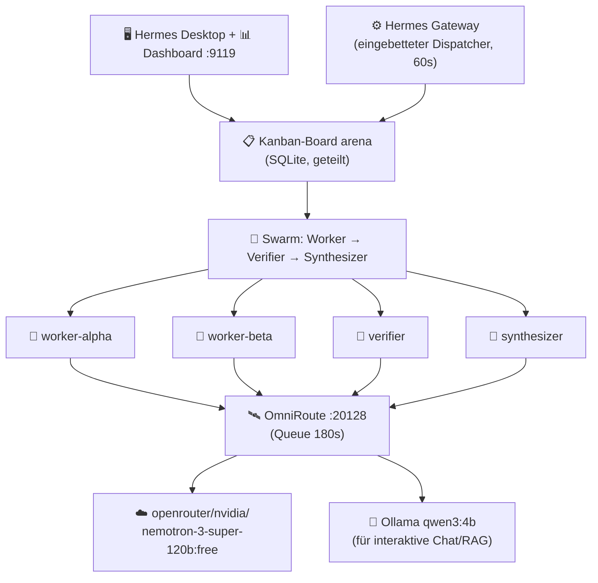

# Hermes Multi-Agent — „Mehr Agents" System

Das fertige **Multi-Agent-System**: mehrere Hermes-Agenten arbeiten **parallel**
über ein gemeinsames Kanban-Board, geroutet über **OmniRoute** → Modell. Alles
lokal bzw. mit kostenlosen Cloud-Modellen. **Ende-zu-Ende getestet und lauffähig.**

---

## Was läuft gerade (Ist-Zustand, 13.08.2026)

| Komponente | Status | Details |
|---|---|---|
| 🦙 **Ollama** | ✅ läuft | `:11434`, lokale Modelle (qwen3:4b + Varianten, qwen2.5:3b …) |
| 🛰️ **OmniRoute** | ✅ läuft (Daemon) | `:20128/v1`, 2117 Modelle, **Queue-Budget auf 180 s erhöht** (`RATE_LIMIT_MAX_WAIT_MS=180000`) |
| ☤ **Hermes Agent** | ✅ installiert | v0.20.0 |
| 🖥️ **Hermes Desktop** | ✅ läuft | Electron-GUI (`Hermes.exe`) |
| 📊 **Hermes Dashboard** | ✅ läuft | `http://localhost:9119` (HTTP 200) |
| ⚙️ **Hermes Gateway** | ✅ läuft | hostet den **eingebetteten Kanban-Dispatcher** (Tick 60 s) |
| 📋 **Kanban-Board** | ✅ aktiv | Board `arena`, Projekt `arena-multi-agent` |
| 🤖 **Agent-Profile** | ✅ 4 Stück | `worker-alpha`, `worker-beta`, `verifier`, `synthesizer` |

**Wichtigster Nachweis:** Ein neu angelegter Task wurde vom Gateway-Dispatcher
**automatisch aufgegriffen und fertig abgearbeitet** (ohne manuellen Dispatch).
Und ein voller **Swarm** (2 parallele Worker → Verifier → Synthesizer) ist komplett
durchgelaufen — Ergebnis als Attachment am Synthesizer-Task.

---

## Architektur



**Schichtung (native Features kombiniert):**
- **Kanban** (`hermes kanban`) — gemeinsames SQLite-Board, atomare Claims,
  Dependencies, auto-Block nach Fehlern.
- **Swarm** (`hermes kanban swarm`) — paralleler Worker-Graph.
- **Profiles** (`hermes profile`) — jeder Agent = isolierte Hermes-Instanz.
- **Gateway-Dispatcher** — Tasks werden ohne Zutun abgearbeitet.
- **OmniRoute** — Provider-Routing (Worker nutzen ein Free-Cloud-Modell,
  interaktive Chat nutzen lokal qwen3:4b).

---

## Die wichtigste Erkenntnis (Modelle)

Die **kleinen lokalen Modelle (2.5B–4B) treiben den komplexen Hermes-Agenten-Loop
nicht zuverlässig**: Sie loopen in Tool-Aufrufen statt Aufgaben zu lösen
(qwen2.5:3b schrieb z. B. endlos `complete.txt`, qwen3:4b fuchtelte mit
sinnlosen Kommandos).

**Lösung:** Die Worker-Profile laufen auf einem **fähigen, kostenlosen Cloud-Modell**
über OmniRoute:
```
openrouter/nvidia/nemotron-3-super-120b-a12b:free
```
Damit lief der Swarm sauber durch. `openrouter/openai/gpt-oss-20b:free` scheiterte,
weil es zwingend Reasoning verlangt (Hermes sendet `reasoning: none`) — daher
nemotron (nicht-Reasoning).

**OmniRoute-Queue:** Beim ersten Versuch droppte OmniRoute parallele Anfragen mit
`503 maxWaitMs=15000`. Fix (persistent in `C:\Users\Hansi\.omniroute\.env`):
```
RATE_LIMIT_MAX_WAIT_MS=180000
```

---

## Nutzung

### Task anlegen → wird automatisch abgearbeitet
```bash
hermes kanban create "Dein Task" --assignee worker-alpha
# Gateway-Dispatcher übernimmt ihn innerhalb von ~60 s
```

### Swarm starten (parallele Agenten)
```bash
hermes kanban swarm \
  --worker "worker-alpha:Aufgabe 1" \
  --worker "worker-beta:Aufgabe 2" \
  --verifier verifier \
  --synthesizer synthesizer \
  --created-by default \
  "Das gemeinsame Ziel"
hermes kanban dispatch   # einmaliger manueller Anstoß (oder warten auf den Tick)
```

### Board ansehen
```bash
hermes kanban list          # CLI
http://localhost:9119       # Dashboard (Web-UI)
hermes desktop --skip-build # Desktop-App
```

### Modelle pro Profil ändern
```bash
grep -A3 "^model:" "C:\Users\Hansi\AppData\Local\hermes\profiles\worker-alpha\config.yaml"
```

---

## Agenten-Profile

| Profil | Rolle | Modell |
|---|---|---|
| `worker-alpha` | Generalist (recherchiert/entwirft) | nemotron-3-super-120b (free) |
| `worker-beta` | Zweiter Generalist (parallel) | nemotron-3-super-120b (free) |
| `verifier` | prüft Worker-Ergebnisse | nemotron-3-super-120b (free) |
| `synthesizer` | schreibt das Endergebnis | nemotron-3-super-120b (free) |
| `default` | interaktiver Chat (Desktop/RAG) | ollama/qwen3:4b (lokal) |

---

## Starten nach Reboot

1. **Ollama** starten (Tray-App, `ollama app.exe`)
2. **OmniRoute**: `RATE_LIMIT_MAX_WAIT_MS=180000 omniroute serve --daemon --no-open`
3. **Gateway** (Dispatcher): `hermes gateway run` (Hintergrund)
4. **Dashboard**: `hermes dashboard`
5. **Desktop**: `hermes desktop --skip-build`

---

## Abnahme-Kriterien (alle erfüllt)

- [x] OmniRoute + Ollama laufen
- [x] Board `arena` + Projekt gebunden
- [x] 4 Agent-Profile existieren
- [x] Swarm mit 2 parallelen Workern komplett durchgelaufen (Worker → Verifier → Synthesizer)
- [x] Auto-Dispatch: Task wurde vom Gateway automatisch abgearbeitet
- [x] Dashboard (:9119) + Desktop laufen
