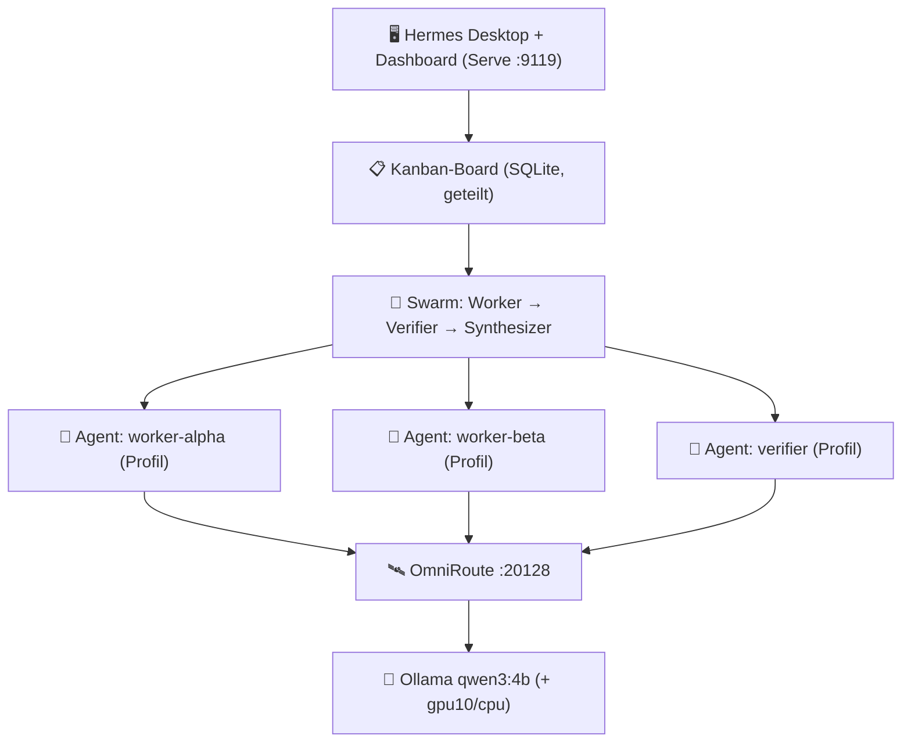

# Roadmap: Hermes Multi-Agent („Mehr Agents")

> Ziel: Die **nativen** Multi-Agent-Features von Hermes voll ausnutzen — mehrere
> Agenten arbeiten **parallel** über ein gemeinsames Kanban-Board, geroutet über
> **OmniRoute** → **Ollama**. Alles lokal, Ende-zu-Ende lauffähig.

## Architektur (Zielbild)

## Phasen (Status 13.08.2026)

| # | Phase | Ergebnis | Status |
|---|---|---|---|
| 0 | Infrastruktur hochfahren | Ollama läuft, OmniRoute verifiziert | ✅ |
| 1 | Modell-Basis prüfen | qwen3:4b + Varianten verfügbar | ✅ |
| 2 | Kanban initialisieren | Board `arena` + Projekt `arena-multi-agent` gebunden | ✅ |
| 3 | Agenten-Profile anlegen | worker-alpha, worker-beta, verifier, synthesizer | ✅ |
| 4 | Tasks anlegen | Swarm-Karten + eigenständige Tasks | ✅ |
| 5 | Swarm + Dispatcher starten | Swarm komplett durchgelaufen, Auto-Dispatch via Gateway verifiziert | ✅ |
| 6 | UI starten | Desktop + Dashboard (:9119) laufen | ✅ |
| 7 | End-to-End-Test + Commit | System läuft, alles als Branch gesichert | ✅ |

> **Modell-Lektion (wichtig):** Kleine lokale Modelle (2.5–4B) treiben den
> Hermes-Agenten-Loop nicht zuverlässig (Tool-Schleifen). Die Worker laufen
> deshalb über OmniRoute auf `openrouter/nvidia/nemotron-3-super-120b-a12b:free`.
> OmniRoutes Queue-Budget wurde auf 180 s erhöht (`RATE_LIMIT_MAX_WAIT_MS`).

## Das Kern-Feature: „Mehr Agents"

Drei native Hermes-Mechanismen werden kombiniert:

1. **Profiles** (`hermes profile`) — jeder Agent = eine isolierte Hermes-Instanz
   mit eigener Identität, die sich Tasks vom Board „claimed".
2. **Kanban** (`hermes kanban`) — gemeinsames SQLite-Board; Tasks werden atomar
   beansprucht, können Dependencies haben und von Dispatcher/Daemon automatisch
   ausgeführt werden.
3. **Swarm** (`hermes kanban swarm`) — paralleler Graph aus Workers, die parallel
   arbeiten, gefolgt von Verifier und Synthesizer.

## Abnahme-Kriterien (alle erfüllt ✅)

- [x] OmniRoute + Ollama laufen, `ollama/qwen3:4b` antwortet
- [x] Board existiert, Projekt gebunden
- [x] ≥ 3 Profile (Agents) existieren (es sind 4)
- [x] Tasks im Board (Swarm-Karten + Auto-Dispatch-Testtask)
- [x] Mindestens 1 Task wird von einem Worker **vollständig abgearbeitet** (Status `done`)
- [x] Swarm-Lauf mit mehreren parallelen Workern läuft durch
- [x] Desktop + Dashboard erreichbar
- [x] Committet als eigener Branch
